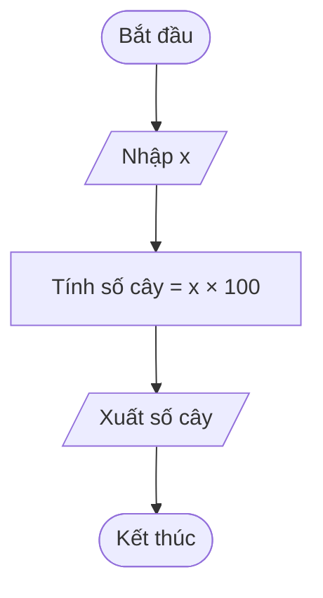

# Lời giải: Trồng cây

## 📋 Tóm tắt đề bài

Một con đường dài **x km**. Cứ mỗi **10 m** trồng 1 cây, bắt đầu từ vị trí 10 m (không trồng cây ở vị trí 0 m). Cây được trồng ở các vị trí: 10 m, 20 m, 30 m, ...

- **Input:** Một số nguyên dương x (1 ≤ x ≤ 10⁹) — chiều dài con đường tính bằng km.
- **Output:** Một số nguyên — tổng số cây cần trồng.
- **Ví dụ:** x = 12 → Output: 1200

## 💡 Ý tưởng giải thuật

Bài này là bài toán tính toán đơn giản:

1. Đổi đơn vị từ **km sang m**: chiều dài tính bằng mét = x × 1000.
2. Vì cứ mỗi 10 m trồng 1 cây, và cây đầu tiên ở vị trí 10 m, nên tổng số cây = chiều dài (m) ÷ 10.
3. Công thức: **số cây = x × 1000 ÷ 10 = x × 100**.

**Ví dụ kiểm tra:** x = 12 → số cây = 12 × 100 = 1200 ✓

**Độ phức tạp:** O(1) — chỉ cần một phép nhân, không cần vòng lặp.

## 🔀 Flowchart giải thuật



## 🧩 Mã giả Scratch

```text
khi bấm cờ xanh
  hỏi [Nhập chiều dài đường (km):] và chờ
  gán [x] = (câu trả lời)
  gán [số cây] = (x * 100)
  nói (kết hợp [Số cây cần trồng: ] và (số cây))
```

## 📝 Giải thích từng bước

1. **Nhập x:** Đọc số nguyên x từ bàn phím — đây là chiều dài con đường tính bằng km.
2. **Tính số cây:** Đổi km sang m bằng cách nhân 1000, rồi chia cho 10 (khoảng cách giữa các cây). Rút gọn lại ta được công thức đơn giản: **x × 100**.
   - x km = x × 1000 m
   - Số cây = (x × 1000) ÷ 10 = x × 100
3. **Xuất kết quả:** In ra số cây vừa tính được.

## ✅ Kiểm tra với ví dụ

**Ví dụ từ đề bài:** x = 12

| Bước | Thao tác | Kết quả |
|------|----------|---------|
| 1 | Nhập x | x = 12 |
| 2 | Tính số cây = x × 100 | 12 × 100 = 1200 |
| 3 | Xuất kết quả | **1200** |

**Kết quả mong đợi:** 1200 ✅

**Kiểm tra thêm:**
- x = 1 → 1 × 100 = 100 cây (1 km = 1000 m, mỗi 10 m 1 cây → 100 cây ✓)
- x = 10 → 10 × 100 = 1000 cây ✓
