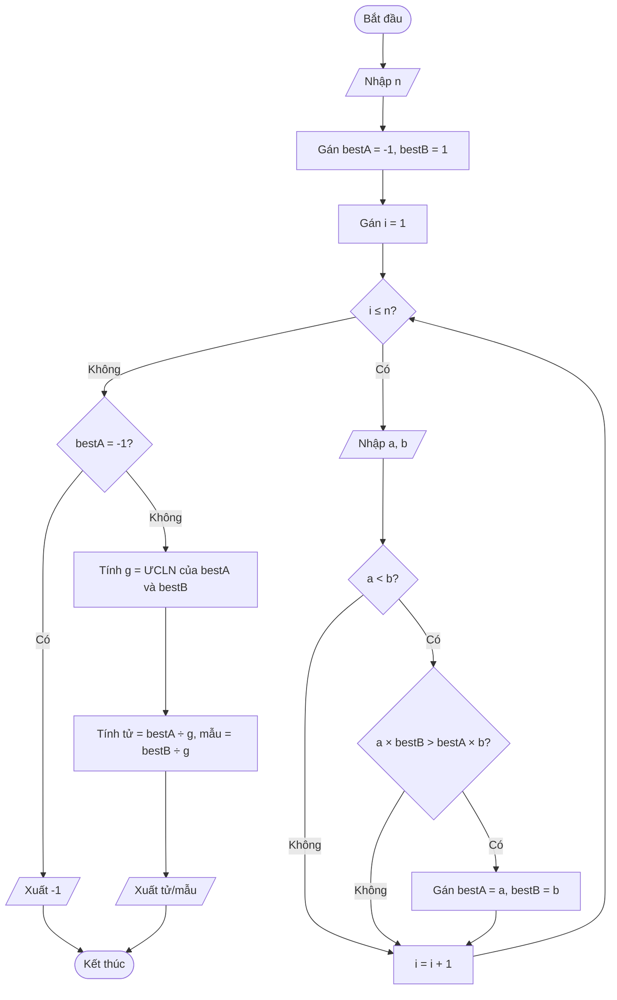

# Lời giải: Trò chơi với phân số

## Nhắc lại đề bài

Trong một giờ ra chơi, hai bạn nhỏ An và Bình rủ nhau chơi một trò chơi với các phân số. Mỗi bạn lần lượt nghĩ ra và viết lên bảng những phân số dạng a_i/b_i trong đó a_i, b_i đều là các số nguyên dương. Chẳng mấy chốc, trên bảng đã có tất cả n phân số để hai bạn cùng quan sát và so sánh.

An đưa ra một thử thách cho Bình: trong tất cả các phân số đã viết, hãy tìm phân số có giá trị lớn nhất nhưng vẫn nhỏ hơn 1. Bình thấy đây là một bài toán khá thú vị nhưng vì số lượng phân số quá nhiều nên Bình tỏ ra rất khó khăn để giải.

**Yêu cầu:** Hãy viết chương trình tính giúp Bình thực hiện thử thách.

**Dữ liệu vào:**
- Dòng đầu tiên chứa số nguyên dương n (1 ≤ n ≤ 10⁴) — số phân số.
- Dòng thứ i trong n dòng tiếp theo, mỗi dòng chứa hai số nguyên dương a_i, b_i (1 ≤ a_i, b_i ≤ 10⁶) — mô tả phân số a_i/b_i.

**Dữ liệu ra:**
- Nếu đáp án là phân số a/b, hãy in kết quả theo định dạng a/b, trong đó phân số phải được đưa về dạng tối giản trước khi in.
- Trường hợp không tồn tại phân số nhỏ hơn 1, hãy in ra -1.

**Ví dụ:**

| standard input | standard output |
|---|---|
| 5<br>1 2<br>3 2<br>24 30<br>6 6<br>7 10 | 4/5 |
| 2<br>3 2<br>67 67 | -1 |

**Giải thích:** Các phân số nhỏ hơn 1 được viết trên bảng là: 1/2, 24/30, 7/10. Trong đó phân số 24/30 có giá trị lớn nhất, có dạng tối giản là 4/5.

## 📋 Tóm tắt đề bài

- Cho n phân số a_i/b_i (a_i, b_i là số nguyên dương).
- Tìm phân số có **giá trị lớn nhất** trong các phân số **nhỏ hơn 1**.
- In kết quả ở **dạng tối giản**. Nếu không có phân số nào nhỏ hơn 1, in -1.
- **Ràng buộc:** n ≤ 10⁴, a_i, b_i ≤ 10⁶.

## 💡 Ý tưởng giải thuật

**Dạng bài:** Duyệt tìm giá trị lớn nhất + Tính ƯCLN (ước chung lớn nhất).

**Các bước:**

1. **Lọc:** Duyệt qua từng phân số, chỉ xét những phân số có a_i < b_i (tức là nhỏ hơn 1).
2. **So sánh:** Trong các phân số nhỏ hơn 1, tìm phân số có giá trị lớn nhất. Để so sánh hai phân số a/b và c/d mà không dùng số thực (tránh sai số), ta so sánh **a × d** với **c × b** (nhân chéo).
3. **Tối giản:** Khi tìm được phân số lớn nhất, chia cả tử và mẫu cho ƯCLN của chúng để đưa về dạng tối giản.

**Cách tính ƯCLN:** Dùng thuật toán Euclid — liên tục chia lấy dư cho đến khi dư bằng 0.

**Độ phức tạp:** O(n × log(max_value)) — rất nhanh với n ≤ 10⁴.

## 🔀 Flowchart giải thuật



## 🧩 Mã giả Scratch (dùng tiếng Anh)

```text
whenFlagClicked()

// Nhập số lượng phân số
askAndWait("Nhập n:")
setVariable(n, getAnswer())

// Khởi tạo phân số lớn nhất
setVariable(bestA, -1)
setVariable(bestB, 1)

// Duyệt từng phân số
setVariable(i, 1)
repeatUntil(i > n) {
    askAndWait("Nhập a:")
    setVariable(a, getAnswer())
    askAndWait("Nhập b:")
    setVariable(b, getAnswer())

    // Chỉ xét phân số nhỏ hơn 1
    if (a < b) then {
        // So sánh nhân chéo: a/b > bestA/bestB ?
        if (a * bestB > bestA * b) then {
            setVariable(bestA, a)
            setVariable(bestB, b)
        }
    }
    changeVariableBy(i, 1)
}

// Xuất kết quả
if (bestA = -1) then {
    say("-1")
} else {
    // Tính ƯCLN bằng thuật toán Euclid
    setVariable(x, bestA)
    setVariable(y, bestB)
    repeatUntil(y = 0) {
        setVariable(temp, y)
        setVariable(y, modulo(x, y))
        setVariable(x, temp)
    }
    // x bây giờ là ƯCLN
    setVariable(tu, divide(bestA, x))
    setVariable(mau, divide(bestB, x))
    say(join(join(tu, "/"), mau))
}
```

## 📝 Giải thích từng bước

### Bước 1: Nhập dữ liệu
- Nhập số n (số lượng phân số).
- Khởi tạo `bestA = -1` và `bestB = 1` để đánh dấu chưa tìm thấy phân số nào nhỏ hơn 1.

### Bước 2: Duyệt từng phân số
- Với mỗi phân số a/b, kiểm tra xem **a < b** hay không (tức phân số nhỏ hơn 1).
- Nếu a ≥ b thì bỏ qua (phân số ≥ 1, không thỏa mãn).

### Bước 3: So sánh nhân chéo
- Nếu phân số nhỏ hơn 1, so sánh với phân số lớn nhất hiện tại bằng **nhân chéo**:
  - a/b > bestA/bestB ⟺ a × bestB > bestA × b
- Nếu lớn hơn, cập nhật `bestA = a`, `bestB = b`.
- **Tại sao nhân chéo?** Vì so sánh bằng phép chia có thể gây sai số do số thực. Nhân chéo giữ nguyên số nguyên, chính xác tuyệt đối.

### Bước 4: Tối giản và xuất kết quả
- Nếu `bestA = -1` (không tìm thấy phân số nào < 1), in `-1`.
- Ngược lại, tính **ƯCLN** (ước chung lớn nhất) của bestA và bestB bằng thuật toán Euclid:
  - Lặp: gán x = y, y = x mod y, cho đến khi y = 0. Khi đó x là ƯCLN.
- Chia cả tử và mẫu cho ƯCLN để được dạng tối giản.
- In kết quả dạng `tử/mẫu`.

## ✅ Kiểm tra với ví dụ

### Ví dụ 1: n = 5, các phân số: 1/2, 3/2, 24/30, 6/6, 7/10

| Bước | Phân số | a < b? | So sánh nhân chéo | bestA/bestB |
|------|---------|--------|--------------------|-------------|
| Khởi tạo | — | — | — | -1/1 |
| i=1 | 1/2 | 1 < 2 ✓ | 1×1 > (-1)×2 → 1 > -2 ✓ | 1/2 |
| i=2 | 3/2 | 3 < 2 ✗ | Bỏ qua | 1/2 |
| i=3 | 24/30 | 24 < 30 ✓ | 24×2 > 1×30 → 48 > 30 ✓ | 24/30 |
| i=4 | 6/6 | 6 < 6 ✗ | Bỏ qua | 24/30 |
| i=5 | 7/10 | 7 < 10 ✓ | 7×30 > 24×10 → 210 > 240 ✗ | 24/30 |

**Kết quả:** bestA = 24, bestB = 30.

**Tối giản:**
- ƯCLN(24, 30): 30 mod 24 = 6 → 24 mod 6 = 0 → ƯCLN = 6
- Tử = 24 ÷ 6 = 4, Mẫu = 30 ÷ 6 = 5

**Output: 4/5** ✅

### Ví dụ 2: n = 2, các phân số: 3/2, 67/67

| Bước | Phân số | a < b? | Kết quả |
|------|---------|--------|---------|
| i=1 | 3/2 | 3 < 2 ✗ | Bỏ qua |
| i=2 | 67/67 | 67 < 67 ✗ | Bỏ qua |

**Kết quả:** bestA vẫn = -1 → Không có phân số nào nhỏ hơn 1.

**Output: -1** ✅
