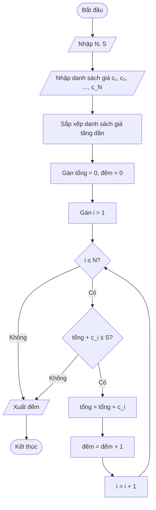

# Lời giải: Mua sắm

## Nhắc lại đề bài

Để chuẩn bị cho buổi tổng kết cuối năm, cô giáo cần mua một số món quà để vinh danh học sinh có thành tích cao. Tại cửa hàng, cô giáo nhận thấy có N phần quà phù hợp để tặng học sinh, trong đó phần quà thứ i (1 ≤ i ≤ N) có giá c_i đồng.

Vì cô giáo muốn nhiều bạn có quà nhất có thể nên cần mua nhiều phần quà nhất. Tuy nhiên cô giáo chỉ có số tiền là S đồng nên tổng giá của các phần quà cô giáo mua không được vượt quá S.

**Yêu cầu:** Hãy xác định số phần quà lớn nhất mà cô giáo có thể mua.

**Dữ liệu vào:**
- Dòng đầu tiên chứa hai số nguyên dương N, S (1 ≤ N ≤ 3×10⁵; 1 ≤ S ≤ 10¹⁸) — số phần quà và số tiền của cô giáo.
- Dòng thứ hai chứa N số nguyên dương c₁, c₂, ..., c_N (1 ≤ c_i ≤ 10⁹) — giá tiền của các phần quà.

**Dữ liệu ra:**
- Một số nguyên duy nhất là số phần quà nhiều nhất mà cô giáo có thể mua được.

**Ví dụ:**

| standard input | standard output |
|---|---|
| 6 20<br>8 5 3 10 2 6 | 4 |

**Giải thích:** Cô giáo mua các phần quà có chỉ số 2, 3, 5, 6 (giá: 5 + 3 + 2 + 6 = 16 ≤ 20). Mua 4 phần quà là nhiều nhất có thể.

## 📋 Tóm tắt đề bài

- Cho N phần quà với giá c₁, c₂, ..., c_N và số tiền S.
- Tìm **số phần quà nhiều nhất** có thể mua sao cho tổng giá **không vượt quá S**.
- **Ràng buộc:** N ≤ 3×10⁵, S ≤ 10¹⁸, c_i ≤ 10⁹.

## 💡 Ý tưởng giải thuật

**Dạng bài:** Tham lam (Greedy).

**Ý tưởng chính:** Muốn mua được **nhiều phần quà nhất**, ta nên ưu tiên mua những phần quà **rẻ nhất** trước.

**Các bước:**

1. **Sắp xếp** danh sách giá tiền theo thứ tự **tăng dần**.
2. **Duyệt** từ phần quà rẻ nhất, cộng dồn giá tiền vào tổng.
3. Nếu tổng **vượt quá S**, dừng lại. Số phần quà đã mua trước đó chính là đáp án.

**Tại sao tham lam đúng?** Vì mỗi phần quà chỉ đếm 1, không phân biệt giá trị. Mua rẻ trước sẽ tiết kiệm tiền nhất, cho phép mua thêm nhiều phần quà hơn.

**Độ phức tạp:** O(N × log N) do sắp xếp — đủ nhanh với N ≤ 3×10⁵.

## 🔀 Flowchart giải thuật



## 🧩 Mã giả Scratch (dùng tiếng Anh)

```text
whenFlagClicked()

// Input number of gifts and budget
askAndWait("Nhập N:")
setVariable(n, getAnswer())
askAndWait("Nhập S:")
setVariable(s, getAnswer())

// Input prices into list
deleteAllOfList(prices)
setVariable(i, 1)
repeatUntil(i > n) {
    askAndWait("Nhập giá phần quà:")
    addItemToList(getAnswer(), prices)
    changeVariableBy(i, 1)
}

// Sort prices in ascending order (Bubble Sort)
setVariable(i, 1)
repeatUntil(i >= n) {
    setVariable(j, 1)
    repeatUntil(j > n - i) {
        if (getItemOfList(j, prices) > getItemOfList(j + 1, prices)) then {
            setVariable(temp, getItemOfList(j, prices))
            replaceItemOfListWith(j, prices, getItemOfList(j + 1, prices))
            replaceItemOfListWith(j + 1, prices, temp)
        }
        changeVariableBy(j, 1)
    }
    changeVariableBy(i, 1)
}

// Greedy: buy cheapest gifts first
setVariable(total, 0)
setVariable(count, 0)
setVariable(i, 1)
repeatUntil(i > n) {
    if (total + getItemOfList(i, prices) <= s) then {
        setVariable(total, total + getItemOfList(i, prices))
        changeVariableBy(count, 1)
    } else {
        stop("this script")
    }
    changeVariableBy(i, 1)
}

say(count)
```

## 📝 Giải thích từng bước

### Bước 1: Nhập dữ liệu
- Nhập N (số phần quà) và S (số tiền).
- Nhập giá của từng phần quà vào danh sách `prices`.

### Bước 2: Sắp xếp giá tăng dần
- Dùng thuật toán **Bubble Sort** (sắp xếp nổi bọt) để sắp xếp danh sách giá từ nhỏ đến lớn.
- So sánh từng cặp phần tử liền kề, nếu phần tử trước lớn hơn phần tử sau thì đổi chỗ.
- **Lưu ý:** Bubble Sort có độ phức tạp O(N²), phù hợp với Scratch. Trong thực tế với N lớn, ta dùng thuật toán sắp xếp nhanh hơn (Quick Sort, Merge Sort).

### Bước 3: Duyệt tham lam
- Bắt đầu từ phần quà rẻ nhất (đầu danh sách đã sắp xếp).
- Cộng dồn giá vào biến `total`.
- Nếu `total + giá phần quà tiếp theo > S`, dừng lại — không đủ tiền mua thêm.
- Đếm số phần quà đã mua vào biến `count`.

### Bước 4: Xuất kết quả
- In ra giá trị `count` — số phần quà nhiều nhất có thể mua.

## ✅ Kiểm tra với ví dụ

**Ví dụ:** N = 6, S = 20, giá: 8, 5, 3, 10, 2, 6

**Sau khi sắp xếp tăng dần:** 2, 3, 5, 6, 8, 10

| Bước | Phần quà (giá) | total + giá ≤ 20? | total | count |
|------|----------------|---------------------|-------|-------|
| Khởi tạo | — | — | 0 | 0 |
| i=1 | 2 | 0 + 2 = 2 ≤ 20 ✓ | 2 | 1 |
| i=2 | 3 | 2 + 3 = 5 ≤ 20 ✓ | 5 | 2 |
| i=3 | 5 | 5 + 5 = 10 ≤ 20 ✓ | 10 | 3 |
| i=4 | 6 | 10 + 6 = 16 ≤ 20 ✓ | 16 | 4 |
| i=5 | 8 | 16 + 8 = 24 > 20 ✗ | Dừng | 4 |

**Output: 4** ✅

**Kiểm tra:** Cô giáo mua 4 phần quà rẻ nhất: 2 + 3 + 5 + 6 = 16 ≤ 20. Nếu mua thêm phần quà thứ 5 (giá 8): 16 + 8 = 24 > 20, không đủ tiền. Vậy 4 là đáp án đúng.
