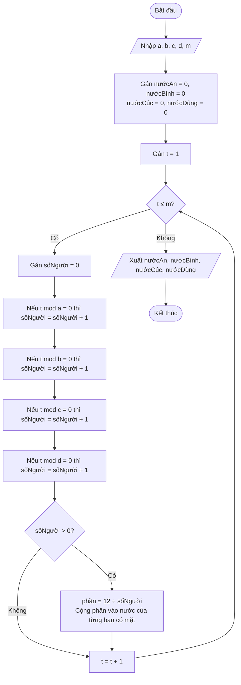

# Lời giải: Lấy nước

## Nhắc lại đề bài

Trong một buổi học ngoại khóa, cô giáo đưa bốn bạn An, Bình, Cúc và Dũng đến tham quan một chiếc giếng nhỏ ở gần trường. Theo quy ước của cô giáo:

- Bạn An đến giếng lấy nước mỗi **a** ngày một lần (ngày a, 2a, 3a, ...).
- Bạn Bình đến giếng lấy nước mỗi **b** ngày một lần (ngày b, 2b, 3b, ...).
- Bạn Cúc đến giếng lấy nước mỗi **c** ngày một lần (ngày c, 2c, 3c, ...).
- Bạn Dũng đến giếng lấy nước mỗi **d** ngày một lần (ngày d, 2d, 3d, ...).

Mỗi ngày, giếng có sẵn **12 lít nước** để chia đều cho các bạn đến lấy trong ngày đó:
- 1 bạn đến → lấy 12 lít
- 2 bạn đến → mỗi bạn 6 lít
- 3 bạn đến → mỗi bạn 4 lít
- 4 bạn đến → mỗi bạn 3 lít

**Yêu cầu:** Sau m ngày, tính tổng lượng nước mà mỗi bạn An, Bình, Cúc, Dũng đã lấy.

**Dữ liệu vào:**
- Một dòng duy nhất chứa năm số nguyên a, b, c, d và m (1 ≤ a, b, c, d ≤ m; 1 ≤ m ≤ 10¹⁵).

**Dữ liệu ra:**
- Bốn số nguyên, lần lượt là số lít nước mà An, Bình, Cúc, Dũng lấy.

**Ví dụ:**

| standard input | standard output |
|---|---|
| 2 1 3 4 10 | 24 72 16 8 |

**Giải thích:** Xét từng ngày từ 1 đến 10:

| Ngày | Ai đến? | Số người | Mỗi người lấy |
|------|---------|----------|----------------|
| 1 | Bình | 1 | 12 lít |
| 2 | An, Bình | 2 | 6 lít |
| 3 | Bình, Cúc | 2 | 6 lít |
| 4 | An, Bình, Dũng | 3 | 4 lít |
| 5 | Bình | 1 | 12 lít |
| 6 | An, Bình, Cúc | 3 | 4 lít |
| 7 | Bình | 1 | 12 lít |
| 8 | An, Bình, Dũng | 3 | 4 lít |
| 9 | Bình, Cúc | 2 | 6 lít |
| 10 | An, Bình | 2 | 6 lít |

Tổng: An = 6+4+4+4+6 = 24, Bình = 12+6+6+4+12+4+12+4+6+6 = 72, Cúc = 6+4+6 = 16, Dũng = 4+4 = 8.

## 📋 Tóm tắt đề bài

- Bốn bạn lấy nước theo chu kỳ a, b, c, d ngày.
- Mỗi ngày giếng có 12 lít, chia đều cho các bạn đến.
- Tính tổng nước mỗi bạn lấy trong m ngày đầu tiên.
- **Ràng buộc:** m ≤ 10¹⁵ (rất lớn!).

## 💡 Ý tưởng giải thuật

**Dạng bài:** Duyệt + Chia đều.

**Phân tích ràng buộc:**
- Subtask 1 (40% điểm): m ≤ 1000 → có thể duyệt từng ngày.
- Subtask 2 (40% điểm): a = b = c = d → tất cả cùng đến, mỗi người luôn lấy 3 lít.
- Subtask 3 (20% điểm): m ≤ 10¹⁵ → cần thuật toán tối ưu hơn.

**Ý tưởng cho Scratch (Subtask 1 — duyệt từng ngày):**

Vì Scratch không hỗ trợ số lớn và thuật toán phức tạp, ta giải bằng cách duyệt từng ngày:

1. Với mỗi ngày t từ 1 đến m:
   - Đếm số bạn đến: kiểm tra t chia hết cho a, b, c, d.
   - Tính lượng nước mỗi bạn nhận = 12 ÷ số người đến.
   - Cộng dồn vào tổng nước của từng bạn có mặt.

**Cách kiểm tra "t chia hết cho a":** t mod a = 0 (phép chia lấy dư bằng 0).

**Độ phức tạp:** O(m) — chạy được với m ≤ 1000.

> **Ghi chú:** Với m ≤ 10¹⁵ (Subtask 3), cần dùng thuật toán dựa trên nguyên lý bù trừ (Inclusion-Exclusion) kết hợp BCNN (bội chung nhỏ nhất) để tính trực tiếp mà không duyệt từng ngày. Thuật toán này quá phức tạp cho Scratch nên ở đây ta trình bày cách duyệt đơn giản.

## 🔀 Flowchart giải thuật



## 🧩 Mã giả Scratch (dùng tiếng Anh)

```text
whenFlagClicked()

// Input frequency of each person
askAndWait("Nhập a:")
setVariable(a, getAnswer())
askAndWait("Nhập b:")
setVariable(b, getAnswer())
askAndWait("Nhập c:")
setVariable(c, getAnswer())
askAndWait("Nhập d:")
setVariable(d, getAnswer())
askAndWait("Nhập m:")
setVariable(m, getAnswer())

// Initialize water totals
setVariable(waterAn, 0)
setVariable(waterBinh, 0)
setVariable(waterCuc, 0)
setVariable(waterDung, 0)

// Loop through each day
setVariable(t, 1)
repeatUntil(t > m) {
    // Count how many people come today
    setVariable(count, 0)
    if (modulo(t, a) = 0) then {
        changeVariableBy(count, 1)
    }
    if (modulo(t, b) = 0) then {
        changeVariableBy(count, 1)
    }
    if (modulo(t, c) = 0) then {
        changeVariableBy(count, 1)
    }
    if (modulo(t, d) = 0) then {
        changeVariableBy(count, 1)
    }

    // Distribute water equally
    if (count > 0) then {
        setVariable(share, divide(12, count))
        if (modulo(t, a) = 0) then {
            changeVariableBy(waterAn, share)
        }
        if (modulo(t, b) = 0) then {
            changeVariableBy(waterBinh, share)
        }
        if (modulo(t, c) = 0) then {
            changeVariableBy(waterCuc, share)
        }
        if (modulo(t, d) = 0) then {
            changeVariableBy(waterDung, share)
        }
    }

    changeVariableBy(t, 1)
}

// Output results
say(join(join(join(join(join(join(waterAn, " "), waterBinh), " "), waterCuc), " "), waterDung))
```

## 📝 Giải thích từng bước

### Bước 1: Nhập dữ liệu
- Nhập a, b, c, d (chu kỳ lấy nước của An, Bình, Cúc, Dũng) và m (số ngày).
- Khởi tạo tổng nước của mỗi bạn = 0.

### Bước 2: Duyệt từng ngày
- Với mỗi ngày t từ 1 đến m, kiểm tra ai đến lấy nước:
  - An đến nếu `t mod a = 0` (t chia hết cho a).
  - Bình đến nếu `t mod b = 0`.
  - Cúc đến nếu `t mod c = 0`.
  - Dũng đến nếu `t mod d = 0`.

### Bước 3: Chia nước
- Đếm số người đến (`count`).
- Nếu `count > 0`, mỗi người nhận `share = 12 ÷ count` lít.
- Cộng `share` vào tổng nước của từng bạn có mặt.

### Bước 4: Xuất kết quả
- In ra 4 số: tổng nước của An, Bình, Cúc, Dũng.

## ✅ Kiểm tra với ví dụ

**Ví dụ:** a = 2, b = 1, c = 3, d = 4, m = 10

| Ngày t | t%2=0? (An) | t%1=0? (Bình) | t%3=0? (Cúc) | t%4=0? (Dũng) | count | share | An nhận | Bình nhận | Cúc nhận | Dũng nhận |
|--------|-------------|---------------|--------------|----------------|-------|-------|---------|-----------|----------|-----------|
| 1 | ✗ | ✓ | ✗ | ✗ | 1 | 12 | — | 12 | — | — |
| 2 | ✓ | ✓ | ✗ | ✗ | 2 | 6 | 6 | 6 | — | — |
| 3 | ✗ | ✓ | ✓ | ✗ | 2 | 6 | — | 6 | 6 | — |
| 4 | ✓ | ✓ | ✗ | ✓ | 3 | 4 | 4 | 4 | — | 4 |
| 5 | ✗ | ✓ | ✗ | ✗ | 1 | 12 | — | 12 | — | — |
| 6 | ✓ | ✓ | ✓ | ✗ | 3 | 4 | 4 | 4 | 4 | — |
| 7 | ✗ | ✓ | ✗ | ✗ | 1 | 12 | — | 12 | — | — |
| 8 | ✓ | ✓ | ✗ | ✓ | 3 | 4 | 4 | 4 | — | 4 |
| 9 | ✗ | ✓ | ✓ | ✗ | 2 | 6 | — | 6 | 6 | — |
| 10 | ✓ | ✓ | ✗ | ✗ | 2 | 6 | 6 | 6 | — | — |

**Tổng kết:**
- An: 6 + 4 + 4 + 4 + 6 = **24** ✅
- Bình: 12 + 6 + 6 + 4 + 12 + 4 + 12 + 4 + 6 + 6 = **72** ✅
- Cúc: 6 + 4 + 6 = **16** ✅
- Dũng: 4 + 4 = **8** ✅

**Output: 24 72 16 8** ✅
